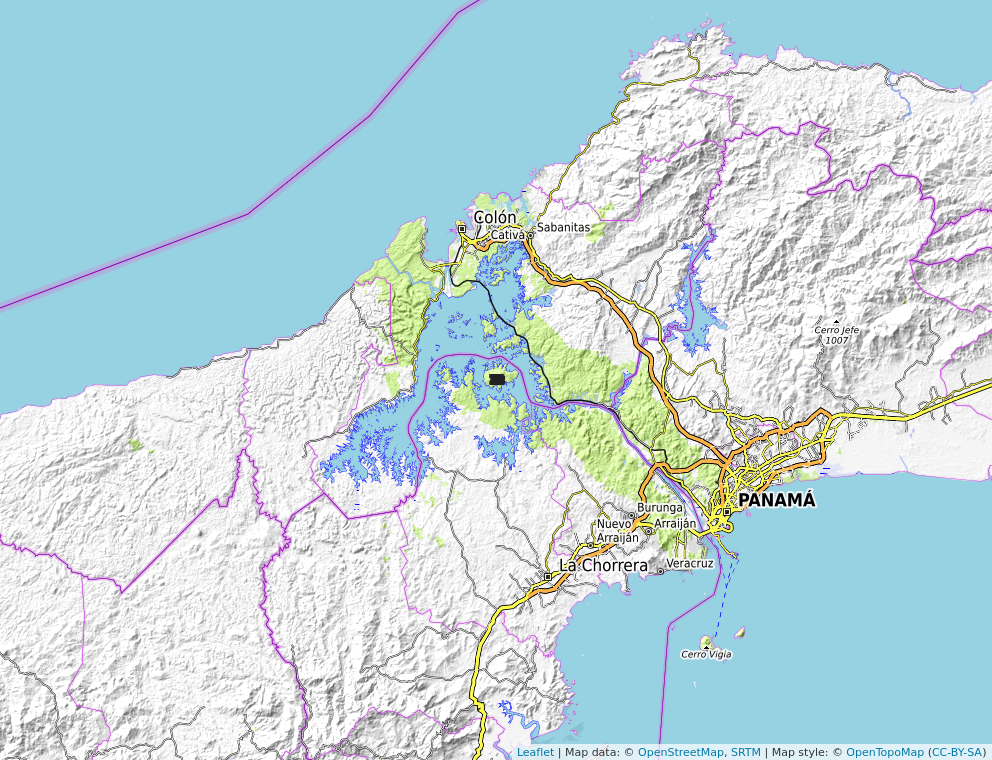

# Introducción

Conocer la dispersion y las formas de agrupamiento de los individuos de una especie, es necesario para su conservacion [@condit1996species, @hubbell1992short]. Las especies no son las mismas en todos los lugares, y estos patrones de variación, en cada uno de los niveles de diversidad: genes, especies y ecosistemas, es el objeto de estudio de la biogeografía. Su objetivo es caracterizar la distribucion de las especies en la actualidad y la variacion geografica de la diversidad en términos de la interacción de los organismos con su ambiente [@lomolino2017biogeography]. La similiridad es una medida simple de la similitud de especies y sus abundancias. Es convencional decir que es lo mismo alta diversidad con alta homogeneidad, lo que es equivalente a poca dominancia [@magurran2004measuring].

Los patrones de biodiversidad son el resultado de la combinacion de los procesos internos de la comunidad de plantas y las condiciones externas del ambiente [@sang2008vascular]. Por ejemplo, la cantidad de nitrogeno en el suelo puede ser asumida como una limitante directa en la distribucion de las especies de plantas [@lange2013physiological]. Numerosas especies de la familia Chrysobalanaceae poseen preferencia por suelos húmedos (@ircCicaco, @PfafLrigida, @sothers2014taxonomic, @grandtner2013dictionary).Esta es una familia de plantas de distribucion pantropical, y cuenta con 18 géneros con 531 especies que se encuentra un 80% en el neotrópico.[@prance2014chrysobalanaceae, @bardon2013origin].

Las especies de Chrysobalaneceae son utilizadas de maneras distintas para el tratamiento y como medicina de algunas enfermedades como la malaria, epilepsia, diarrea y diabetes [@feitosa2012chrysobalanaceae]. Sus usos son frecuentes en la región africana y surámericana, donde son más abundantes [@feitosa2012chrysobalanaceae].
Posee diferentes usos como: El aceite de sus frutos para pinturas y varnices, tambien su madera como material de construccion, combustible y carbón. Ademas es utilizada mezclada con arcilla para hacer vasijas de barro [@prance2014chrysobalanaceae].

La parcela permanente de la isla de Barro Colorado es una reserva de investigacion biologica a cargo del Smithsonian Tropical Research Institute [@croat1978flora].  
Segun @condit1998tropical la distribucion de *Hirtella americana* en la parcela permanente de BCI se encuentra de manera irregular en pequeñas areas isoladas. Sin embargo, los estudios realizados no han demostrado que esta irregularidad se deba a variables ambientales. @croat1978flora menciona que *Hirtella americana* es una de las especies mayor representadas por su densidad en este bosque.

Con el motivo de aplicar estudios de ecología numérica y aprender a utilizarlos en futuras investigaciones, además de descubrir si existen patrones de correlación entre la familia de plantas Chrysobalanaceae y algunas variables ambientales, esta investigación tiene como objetivos conocer la distribución espacial de las especies de la familia Chrysobalanaceae, conoces si se agrupan en grupos discontinuos en función de su composición, y reconocer si estos patrones se encuentran relacionados con alguna variable ambiental. Además de identificar, en caso de que existan, las tendencias de ordenación de la especies de Chrysobalanaceae representadas en BCI y su correspondencia con las variables del ambiente. Este estudio busca estimar la riqueza de la familia Chrysobalanceae en la parcela permanente de Barro Colorado Island y descubir la relación entre la diversidad alpha y las variables ambientales, además de la relación de las especies con la diversidad beta. Tambien identificar si los modelos de distribución de especies predicen la ocurrencia de las especies representadas en el estudio. 

Para realizar un estudio a fondo de la correlación entre esta familia y las variables ambientales era necesario realizar multiples analisis de ecología numerica, por esta razon se realizaron analisis de agrupamiento, tecnicas de ordenacion, analaisis de diversidad y ecología espacial. Ya que cada uno responde a distintas preguntas de investigación. Este estudio intenta resumir los patrones de diversidad asociados a la familia Chrysobalanaceae en la parcela permanente de BCI. 

# Metodología

## Obtención de los datos

Los datos fueron obtenidos del censo realizado durante el 2010 por el Smithsonian Tropical Research Institute en la parcela permanente de Barro Colorado Island en el lago Gatún, Panamá [@Hubbell2010Forest]. En este censo, se contabilizaron todas las árboles con troncos de al menos 10mm de Diámetro de Altura de Pecho, y estos fueron identificados y marcados. Esta parcela cuenta con 50 hectáreas dividida en 50 cuadros de 1 hectárea cada una.

{width = 80%}

Los datos utilizados en esta investigación fueron administrados a través del repositorio @jose_ramon_martinez_batlle_2020_4402362. Estos datos continenen la matriz de comunidad y la matriz ambiental. En la matriz de comunidad se extrajeron los datos de la familia Chrysobalanaceae.  

## Analisís estadístico

<!--
Analisis de Agrupamiento

Para el analisis de agrupamiento se tomaron en consideración cuatro técnicas jeracquicas y aglomerativas: por enlace simple,por enlace completo, por enlace promedio (UPGMA) y por el método de Ward. En primer lugar se transformaron los datos de la matriz de comunidad y se calculó la distacia ecuclídea.Cuales seleccionaste por que parametro.

Para conocer el patrón de organización de la familia Chrysobalanaceae y seleccionar el dendrograma que mejor explica las relaciones entre esta familia, se realizaron pruebas de distancia cofenética y anchura de siluetas para conocer el número de grupos. Por medio de Bootstrap multiescalar se revisaron los datos obtenidos en los métodos anteriores.

Para evaluar la homogeneidad de promedios de las variables, se utilizará la prueba t student. Para así conocer si existe algún patron de agrupamiento relacionado con alguna variable ambiental.

Además se realizó un analisis de especies indicadoras mediante la prueba de IndVal y un analisis de especies con preferencia por habitát mediante el coeficiente de correlación biserial puntual (Phi).

Técnicas de Ordenación: Mencionar parametros
Las técnicas de ordenación no restringidas utilizadas fueron: Análisis de componentes principales (PCA), Análisis de Correspondencia múltiple (MCA) y Análisis de corrdenadas principales (PCoA).

Para la técnicas de ordenación restringida se utilizarán los métodos: Análisis de Redundancia (RDA) y Analisis de correspondencia canónica (CCA).

La técnicas de ordenación son para detectar tendecias entre las especies de mi familia seleccionada y ver si se asocian con las variables ambientales.

Analisis de Diversidad: Mencionar parametros
Para el calculo de la estimacion de la riqueza y completitud de la muestra se utilizaron los enfoques de Chao, estimadores Jacknife y el método por Bootstrap.

Se calcularon los números y ratios de Hill para el calculo de la diversidad Alpha y se midió la correlación con las variables ambientales.
Para el calculo de la diversidad Beta se obtuvo la beta multiplicativa y se calculo las especies que contribuyen a esta diversidad.

Ecología Espacial: Mencionar parametros
Se utilizó una matriz tranformada a Hellinger y se calculó la vecindad. Mediante un correlograma se midió la autocorrelación espacial, utilizando las pruebas Mantel y el I de Moran.

Esta prueba tiene como objetivo conocer si las especies muestran un patrón aglomerado, y conocer si se asocian con alguna variable. Además, de verificar si los modelos de distribución de especies predicen la ocurrencia de estas.

Los análisis fueron realizados en la consola de RStudio [@RStudio] administrada por José Ramón Martínez Batlle.

# Resultados

#Analisis de Agrupamiento

La familia Chrysoblanaceae cuenta con un total de 4,821 individuos y se encuentra representada en BCI por cuatro especies: *Hirtella americana*, *Hirtella triandra*, *Licania platypus* y *Licania hypoeluca*. La especie mas abundante fuer *Hirtella triandra* con un total de 4,408 individuos, lo que representa un 90% de la representacion de la familia en BCI.
Los sitios con mayor valores de abundancia son el 16, 21, 26, 48 y y 49.

<!--  Insertar cuadros de abundancia

Las variables ambientales o atributos que mostraron relacion con la abundancia de especies fueron Fosforo (-0.59) y Aluminio (-0.48), y Nitrogeno min., Potasio, Hierro, Cobre y Calcio en aproximadamente (0.51).
La riqueza de mi familia mostro relacion en un 0.38 con el N. min.
*Licania platypus* muestra una relacion de 0.51 con *Hirtella triandra*.
Los valores bajos de geomorfologia de hombrera concuerdan con los sitios de mayor abundancia.

<!-- Insertar grafico de disimiliridad de Jaccard y grafico de similaridad de especies

<!-- Los cuadros (o quadrats) de 1 hectárea, ¿se organizan en grupos discontinuos según la composición de las especies de mi familia seleccionada?

Los analisis de agrupamiento por medio de las tecnicas UPGMA, Ward y Complete dieron dos grupos consistentes, un grupo formado por los sitios (24, 25, 29 y 30) y un grupo formado por el resto. Sin embargo, los dendrogramas escogidos fueron los creados por el metodo complete y por el metodo Ward. La anchura de silueta obtenida fue de dos.
<!-- Porque escogiste esos dos metodos.

<!-- Si existe algún patrón, ¿es consistente con alguna variable ambiental/atributo?
El analisis de correlacion del dendrograma generado por UPGMA y las variables ambientales mostro relaciones significativas con la elevacion media, geomorfologia de hombrera, heterogeneidad ambiental y N.
En el analisis de Ward para dos grupos las variables que mostraron relacion significativa fueron: Geomorflogia de hombrera, heterogeneidad ambiental y Nitrogeno.
Para el analisis de correlacion con el dendrograma generado por Complete las variables relacionadas fueron: Elevacion media, geomorfologia de hombrera, Magnesio y Nitrogeno.
Podemos concluir que las variables que muestran mayor relacion con los patrones de agrupamiento de sitios son geomorfologia de hombrera y Nitrogeno.

<!-- ¿Hay especies indicadoras o con preferencia por determinadas condiciones ambientales/atributos?

Licania hypoeluca muestra ser una especie indcadora para el grupo 2 (4 sitios), tanto en UPGMA por Indval como por Phi. Al igual que en Complete. Debido a la diferencia de la cantidad de los sitios en los grupos, la prueba Inval se realizo con grupos igualados.

Tecnicas de Ordenacion
En un espacio bidimensional, ¿existen tendencias apreciables de ordenación de las especies de mi familia seleccionada?
En el Biplot de PCA los sitios 24, 25, 29 y 30 (el grupo 2), tiene relacion con N, P y pH en la distacia euclidea, y para datos transformados con P y N.
Segun el PCA realizado con los datos de la comunidad, ninguna especie es homogenea en la contribucion de los componentes. 
El grupo 2, los sitios 24, 25, 29 y 30, muestran relacion con la presencia de Licania hypoeluca segun PCA, y quizas se relaciona con la presencia de aluminio.
El grupo 2 ademas muestra relacion con la elevacion media y geomorfologia de llanura, segun PCA.
En el analisis de PCA, las variables de suelo muestran relacion con las especies.
El analisis de correspondencia de CHI cuadrado mostro resultados similares, de la relacion entre Licania hypoeluca con los sitios 24, 25, 29 y 30.

<!-- Rehacer PCA para variables asociadas.

Si existen tendencias de ordenación, ¿se asocian éstas con variables ambientales/atributos?

# Discusión
¿Porque es Hirtella triandra es mucho mas abundante que las demas?
Analisis de agrupamiento: Porque el grupo de 4 sitios es consistente.

# Agradecimientos

# Información de soporte

# *Script* reproducible

# Referencias
