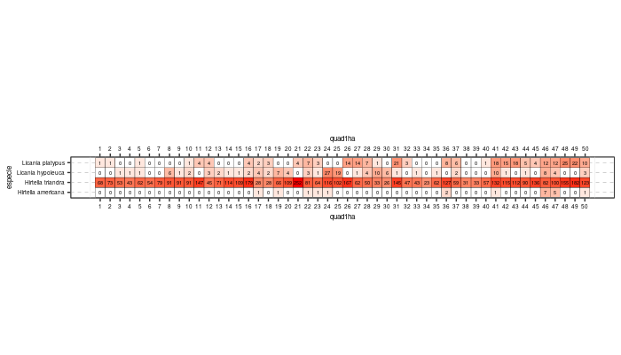

```{r, include=FALSE}
source("aed1.R", local = knitr::knit_global())
```


# Introducción

Ahora estoy insertando bibliografia, si lo quiero entre parentesis [@hubbell1999light], y si lo quiero parte del texto @hubbell1999light.

Para citar dos autores [@hubbell1999light, @sun2007fast]

# Metodología

Aqui va la metodologia.

# Resultados

La familia Chrysobalanaceae esta compuesta por 4 especies dispuestas en dons generos: Hirtella american y triandra, y Licania hypoleuca y platypus.
La especie mas abundante es Hirtella triandra con 4,408; le sigue Licania platypus con 251, Licania hypoeluca con 141, e Hirtella americana con 21. El numero total de individuos es 4,821. 

Los lugares 34 y 38 revisar. (Ver figura \ref
{cuadroabun})

Ahora vamos a insertar imagen:

{width=80%}

Vamos a editar la imagen ahora: \ref{fig:abunsp}

```{r, echo=FALSE, fig.cap="\\label{fig:abunsp}Abundancia de especies por cuadros"}
abun_sp_q

```


Y ahora una tabla: 

| Especie | Abundancia |
|---------|------------|
| 1       | 10         |
| 2       | 20         |
| 3       | 30         |
| 4       | 40         |

Insertar tabla con knitr: Aqui esta la referencia \ref{tab:tababun}

```{r, , echo=FALSE}
knitr::kable(abun_sp,
             caption = "\\label{tab:tababun}Abundancia de especies de la familia Chrysobalaneceae")
```

# Discusión

# Agradecimientos

# Información de soporte


# *Script* reproducible


# Referencias
