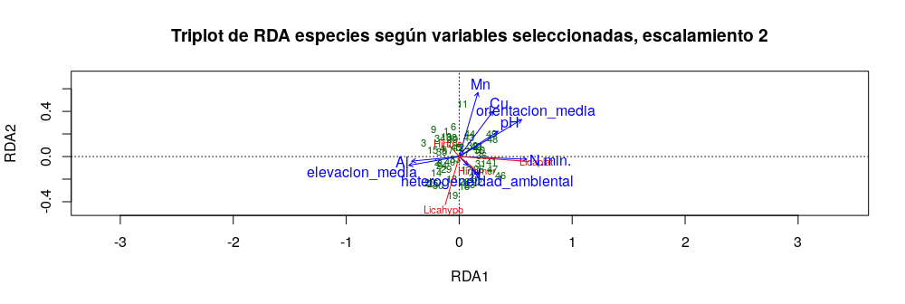

```{r, include=FALSE}
    source("Script_rep.R", local = knitr::knit_global())
```

# Introducción

Conocer la dispersion y las formas de agrupamiento de los individuos de una especie, es necesario para su conservacion [@condit1996species, @hubbell1992short]. Las especies no son las mismas en todos los lugares, y estos patrones de variación, en cada uno de los niveles de diversidad: genes, especies y ecosistemas, es el objeto de estudio de la biogeografía. Su objetivo es caracterizar la distribucion de las especies en la actualidad y la variacion geografica de la diversidad en términos de la interacción de los organismos con su ambiente [@lomolino2017biogeography]. La similiridad es una medida simple de la similitud de especies y sus abundancias. Es convencional decir que es lo mismo alta diversidad con alta homogeneidad, lo que es equivalente a poca dominancia [@magurran2004measuring].

Los patrones de biodiversidad son el resultado de la combinacion de los procesos internos de la comunidad de plantas y las condiciones externas del ambiente [@sang2008vascular]. Por ejemplo, la cantidad de nitrogeno en el suelo puede ser asumida como una limitante directa en la distribucion de las especies de plantas [@lange2013physiological]. Numerosas especies de la familia Chrysobalanaceae poseen preferencia por suelos húmedos (@ircCicaco, @PfafLrigida, @sothers2014taxonomic, @grandtner2013dictionary).Esta es una familia de plantas de distribucion pantropical, y cuenta con 18 géneros con 531 especies que se encuentra un 80% en el neotrópico.[@prance2014chrysobalanaceae, @bardon2013origin].

Las especies de Chrysobalaneceae son utilizadas de maneras distintas para el tratamiento y como medicina de algunas enfermedades como la malaria, epilepsia, diarrea y diabetes [@feitosa2012chrysobalanaceae]. Sus usos son frecuentes en la región africana y surámericana, donde son más abundantes [@feitosa2012chrysobalanaceae].
Posee diferentes usos como: El aceite de sus frutos para pinturas y varnices, tambien su madera como material de construccion, combustible y carbón. Ademas es utilizada mezclada con arcilla para hacer vasijas de barro [@prance2014chrysobalanaceae].

La parcela permanente de la isla de Barro Colorado es una reserva de investigacion biologica a cargo del Smithsonian Tropical Research Institute [@croat1978flora].  
Segun @condit1998tropical la distribucion de *Hirtella americana* en la parcela permanente de BCI se encuentra de manera irregular en pequeñas areas isoladas. Sin embargo, los estudios realizados no han demostrado que esta irregularidad se deba a variables ambientales. @croat1978flora menciona que *Hirtella americana* es una de las especies mayor representadas por su densidad en este bosque.

Con el motivo de aplicar estudios de ecología numérica y aprender a utilizarlos en futuras investigaciones, además de descubrir si existen patrones de correlación entre la familia de plantas Chrysobalanaceae y algunas variables ambientales, esta investigación tiene como objetivos conocer la distribución espacial de las especies de la familia Chrysobalanaceae, conoces si se agrupan en grupos discontinuos en función de su composición, y reconocer si estos patrones se encuentran relacionados con alguna variable ambiental. Además de identificar, en caso de que existan, las tendencias de ordenación de la especies de Chrysobalanaceae representadas en BCI y su correspondencia con las variables del ambiente. Este estudio busca estimar la riqueza de la familia Chrysobalanceae en la parcela permanente de Barro Colorado Island y descubir la relación entre la diversidad alpha y las variables ambientales, además de la relación de las especies con la diversidad beta. Tambien identificar si los modelos de distribución de especies predicen la ocurrencia de las especies representadas en el estudio. 

Para realizar un estudio a fondo de la correlación entre esta familia y las variables ambientales era necesario realizar multiples analisis de ecología numerica, por esta razon se realizaron analisis de agrupamiento, tecnicas de ordenacion, analaisis de diversidad y ecología espacial. Ya que cada uno responde a distintas preguntas de investigación. Este estudio intenta resumir los patrones de diversidad asociados a la familia Chrysobalanaceae en la parcela permanente de BCI. 

# Metodología
## Obtención de los datos

Los datos fueron obtenidos del censo realizado durante el 2010 por el Smithsonian Tropical Research Institute en la parcela permanente de Barro Colorado Island en el lago Gatún, Panamá [@Hubbell2010Forest]. En este censo, se contabilizaron todas las árboles con troncos de al menos 10mm de Diámetro de Altura de Pecho, y estos fueron identificados y marcados. Esta parcela cuenta con 50 hectáreas dividida en 50 cuadros de 1 hectárea cada una.

{width=50%}

Los datos utilizados en esta investigación fueron administrados a través del repositorio @jose_ramon_martinez_batlle_2020_4402362. Estos datos continenen la matriz de comunidad y la matriz ambiental. En la matriz de comunidad se extrajeron los datos de la familia Chrysobalanaceae.  

## Análisis estadístico

Para conocer los patrones de agrupamiento según la composición de especies de Chrysobalanaceae se realizó un análisis de agrupamiento tomando en consideración cuatro técnicas jerarquicas y aglomerativas [@borcard2011numerical, @krebs1999ecological], las cuales fueron: por enlace simple,por enlace completo, por enlace promedio (UPGMA) y por el método de Ward. Los datos de la matriz de comunidad fueron normalizados y se calculó la distancia euclídea, para luego proceder a realizar las técnicas de agrupamiento.   

Para conocer el patrón de organización de la familia Chrysobalanaceae y seleccionar el dendrograma que mejor explica las relaciones entre las especies de esta familia, se realizaron pruebas de distancia cofenética; y para conocer el número de grupos óptimo se calculó la anchura de siluetas. Por medio de Bootstrap multiescalar se revisaron los datos obtenidos en los métodos anteriores. Para evaluar la relación de los grupos obtenidos con las variables ambientales se utilizó una prueba de igualdad de promedios por t student y la prueba no paramétrica de la suma de rangos de Wilcoxon (medianas). Además, se realizó un análisis de especies indicadoras mediante la prueba de IndVal y un analisis de especies con preferencia por hábitat mediante el coeficiente de correlación biserial puntual (Phi).

Las técnicas de ordenación consisten en colocar objetos o variables en un espacio donde cada uno representa una dimensión [@borcard2011numerical]. Los gráficos generados mediante estos análisis muestran una relación ordenada de las variables formando un diagrama de dispersión [@legendre2012numerical, @legendre2001ecologically].

A fin de detectar las tendencias de ordenación de las especies de la familia Chrysobalanaceae se utilizaron diferentes técnicas de tipo restringida y no restringida. El análisis de componentes principales (PCA) se realizó para variables ambientales utilizando solo las variables numéricas y escalándolas a puntuaciones Z para generar una matriz de correlaciones; para las variables de la matriz de comunidad los datos fueron transformados basados en Hellinger. El análisis de correspondencia (CA) se realizó calculando las distancias de los objetos en CHI cuadradro. La técnicas de ordenación restringida utilizada fue un análisis de correspondencia canónica (CCA).

Para el análisis de la diversidad Alpha se calcularon los números de diversidad Alpha y los ratios de Hill como se encuentra explicado por @krebs1999ecological y @borcard2011numerical. Los sitios que poseían solo una especie fueron excluidos. Posteriormente, se realizó un análisis de correlacion de pearson con las variables ambientales seleccionadas, para conocer si existe asociación con la diversidad Alpha. Con el objetivo de medir la diversidad de especies de una localidad cuando solo se tienen una muestra de la riqueza total de la comunidad, se utilizó el enfoque asintótico no paramétrico de Chao. La diversidad beta calculada con los datos de presencia/ausencia de las especies nos dice cúantas más especies están presentes en toda el área que en un sitio individual [@borcard2011numerical]. La contribución local de los sitios y las especies a la diversidad beta fue realizada siguiendo los procedimientos indicados por @borcard2011numerical.

Uno de los fundamentos de la ecología espacial es comprender como el espacio impacta en la estructura de la comunidad [@cantrell2010spatial]. La autocorrelación espacial es una medida de la similaridad o disimilaridad de dos sitios cercanos con relación a los pares seleccionados aleatoriamente [borcard2011numerical]. El análisis de correlacción espacial se realizó siguiendo la metodología descrita por @jose_ramon_martinez_batlle_2020_4402362. En primer lugar, los datos de la matriz de comunidad fueron transformados midiendo la distancia Hellinger, y se generó la vecindad para la matriz ambiental. Entonces, la autocorrelación de las especies y las variables ambientales se midió a partir de un correlograma. Posteriormente, se  eliminaron las tendencias espaciales de autocorrelación transformando la matriz de comunidad Hellinger en una matriz de posiciones XY, para luego realizar una prueba Mantel de correlograma. De igual forma, se evaluó la autocorrelación espacial por I de Moran sin tomar en cuenta las tendencias espaciales.

Los análisis fueron realizados en la consola de RStudio [@RStudio] administrada por José Ramón Martínez Batlle. Para acceder a la consola se realizó mediante el navegador Google Chrome en una computadora personal de prestaciones básicas. Los paquetes utilizados para los diferentes análisis fueron @veganR, @biodiversityR, @tidyverseR y @indicspeciesR.

# Resultados

La familia Chrysobalanaceae se encuentra representada en BCI por un total de 4,821 individuos formada por las especies *Hirtella americana*, *Hirtella triandra*, *Licania platypus* y *Licania hypoleuca* \ref{tab:abun_sp}. La especie más abundante fue *Hirtella triandra*, que representa un 90% de la composición de la familia en BCI.

```{r, echo=FALSE}
    knitr::kable(abun_sp, 
                 caption = "\\label{tab:abun_sp}Tabla de abundancias de las especies de Chrysobalanaceae en BCI")
```

Los análisis de agrupamiento por medio de las cuatro técnicas mostraron grupos similares, con un grupo consistente en todas las técnicas formado por los sitios 24, 25, 29 y 30. Los dendrogramas que mostraron mayor correlación cofenética fueron los creados por los métodos de enlace completo y enlace promedio (UPGMA). El número de grupos obtenido mediante el cálculo de anchura de silueta fue de dos para los dendrogramas generados por enlace completo, por enlace pormedio (UPGMA) y por Ward.

El mapa de calor generado para los dendrogramas muestra ligeramente la apariencia de tres grupos, sin embargo el análisis mediante boostrap multiescalar refuerza la partición en solo dos grupos para UPGMA, Ward y por enlace completo. Ya que los dendrogramas generados por UPGMA y por enlace completo mostraron resultados muy similares, los dendrogramas utilizados para posteriores análisis fueron los generados por medio de agrupamiento por enlace completo y Ward para dos grupos óptimos \ref{clusters}. El grupo uno formado por 46 sitios y el grupo dos formado por 4 sitios \ref{mapagrupos}.

{width=100%}

{width=50%}

Las pruebas de igualdad de promedios realizadas por medio de t-student y la suma de rangos de Wilcoxon mostró que las variables heterogeneidad ambiental, Nitrógeno y elevación media muestran relación significativa con los grupos formados por medio del análisis de agrupamiento. 

Los análisis de especies indicadoras o con preferencia por determinados hábitats dio como resultado que *Licania hypoleuca* parece ser una especie indicadora para el grupo 2 (formado por los sitios 24, 25, 29 y 30).

Mediante el cálculo de los factores de inflación (VIF) de las variables de suelo y ambientales se escogió un grupo reducido de variables que tuvieran poca correlación entre ellas con un VIF menor de 10. Las variables escogidos fueron Aluminio, Cobre, Manganeso, Nitrógeno, pH, Nitrógeno mineralizado, elevación media, heterogeneidad ambiental y orientación media.

El análisis de componentes principales para los datos de variables ambientales seleccionadas dio como resultado que los sitios se asocian en dos grupos distintivos, sin embargo estos grupos no se corresponden con los generados por medio del análisis de agrupamiento por enlace completo (\ref{pcagroup}).

{width=80%}

El análisis de componentes principales (PCA) aplicado a la matriz de comunidad muestra la relación de *Licania hypoleuca* con los sitios del grupo 2 del análisis de agrupamiento generado por enlace completo \ref{pcaespecies}, al igual que en el análisis de correspondecia. Esta especie parece asociarse de manera inversa con la abundancia de Manganeso. Las especies *Hirtella triandra* e *Hirtella americana* presentan correlación inversa, pues los vectores se muestran en direcciones completamente opuestas.

{width=80%}

Los resultados del análisis de correspondencia canónica explican un 47% de los datos y en la grafica se puede verificar que *Hirtella triandra* es la especie con mayor abundancia, pues se encuentra en el centro del gráfico. También se muestra que *Licania platypus* se encuentra muy correlacionada con la abundancia de nitrógeno mineralizado (\ref{triplotrda}). 

{width=80%}

Las variables ambientales Magnesio, Zinc, Nitrógeno mineralizado y geomorfología de interfluvio mostraron relación con los números de Hill. Mientras que pH y Nitrógeno parecen estar correlacionadas con la equidad de Pielou (\ref{diversidadalpha}). El trabajo de muestreo realizado en BCI con relación a la familia Chrysobalanaceae se estima que representa un 100% de completitud de la muestra, según los estimadores de Chao \ref{extrapolacion}, por lo que podemos afirmar que esta familia se encuentra muy bien representada en BCI.

{width=80%}

{width=80%}

Sin embargo, al realizar la estimación de la riqueza por medio de los estimadores de Chao para los grupos generados en el análisis de agrupamiento, se estima que el grupo 1 se encuentra representado en un 100%, pero para el grupo 2 es necesario aumentar el esfuerzo de muestreo. Esto puede deberse a la desigualdad del número de sitios en los grupos. 

La diversidad beta multiplicativa disminuye mientras aumenta la importancia de la abundancia más que la riqueza, esto se debe a la autocorrelación espacial de los sitios, y demuestra que la diversidad de la comunidad está marcada por la presencia de especies indicadoras. Las especies que muestran contribución a la diversidad beta son *Licania hypoleuca* y *Licania platypus*, mientras que ninguno de los sitios resultó como contribuyente.

Mediante la prueba de correlograma las variables Boro, Calcio, Magnesio, Zinc, Nitrógeno, pH y Nitrógeno mineralizado mostraron correlación en múltiples órdenes (\ref{correlograma}). La prueba Mantel sin tendencias de autocorrelación muestra que en los residuos la correlación no es significativa, por lo que parece que hay una dependencia espacial inducida por las variables ambientales.  El I de moran aplicado a la matriz sin tendencia espacial dio como resultado que *Licania hypoleuca* e *Hirtella triandra* se encuentran en un patrón aglomerativo (\ref{lisamaps}). Las variable que muestra un patrón aglomerativo común es la elevación media.

{width=80%}

{width=80%}

#Discusión

La composición de especies de la familia Chrysobalanaceae en BCI no parece organizarse en patrones discontinuos, aunque los análisis de agrupamiento muestran un grupo formado por los sitios 24, 25, 29 y 30 que se caracteriza por la abundancia de *Licania hypoleuca*.

Las técnicas de análisis de ordenación al comparar sitios y especies demuestra, al igual que el análisis de agrupamiento, que los sitios del grupo 2 se encuentran correlacionados con la abundancia de *Licania hypoleuca*. Esta tendencia de ordenación parece asociarse de manera inversa con la abundancia de Manganeso, además este análisis muestra que la abundancia de *Licania platypus* se correlaciona con el nitrógeno mineralizado. 

Debido a que el método de muestreo utilizado para generar la base de datos usada en esta investigación se trata de un censo, es por esto que el análisis de estimación de riqueza muestra una alta completitud de la muestra. Las especies raras son el mayor contribuyente a la diversidad beta de la comunidad.

Los datos parecen mostrar una correlación espacial inducida alta. Sin embargo, al general los mapas Lisa las especies *Licania hypoleuca* e *Hirtella triandra* solo parecen mostrar un patrón aglomerado con respecto a la orientación media.

Se recomienda aplicar otras técnicas de ecología numérica a estos datos para comparar los resultados de la variables selecionadas, y verificar los modelos de agrupamiento obtenidos además de como se relacionan con las variables ambientales.

# Agradecimientos

Agradezco al profesor José Martínez Batlle por sus enseñanzas y su apoyo en el análisis de esta investigación. También al Smithsonian Tropical Research Institute por la obtención y el suministro de los datos.

# *Script* reproducible

```{r, echo=FALSE}
script <- readLines("Script_rep.R")
print(script)
```


# Referencias
